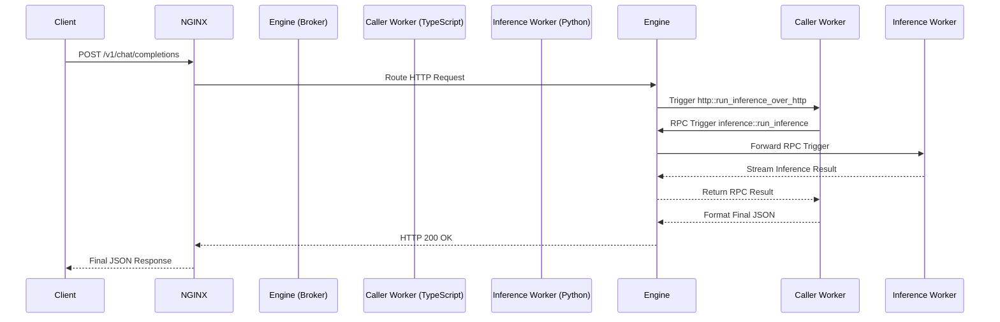

# Distributed Inferencing Prototype (AWS GitOps Edition)

A production-ready, distributed AI worker mesh deployed securely on AWS using Terraform. It features an NGINX API Gateway routing requests to internal TypeScript and Python microservices communicating over WebSocket RPC. The mesh seamlessly handles HTTP parsing and offloads heavy LLM inference to a dedicated, isolated backend worker.

## 📐 Architecture Diagrams

  

## 🔄 Request Flow Diagram



## 🧩 Component Overview

1. **API Gateway (`iii-engine` + NGINX)**: Resides on the edge, terminating HTTP/WebSocket traffic, and acting as the central RPC message broker for the mesh.
2. **Caller Worker (TypeScript)**: Intercepts the HTTP request, parses the payload, and dynamically triggers an RPC call to the inference worker.
3. **Inference Worker (Python)**: Subscribes to the mesh and listens for inference triggers. Loads the **Qwen2.5-0.5B-Instruct** Language Model via PyTorch/Transformers and streams the generated text back through the mesh.

## ⚙️ Worker Functions

| Worker             | Language   | Function                       | Does                                                                                          |
| ------------------ | ---------- | ------------------------------ | --------------------------------------------------------------------------------------------- |
| `inference-worker` | Python     | `inference::run_inference`     | Loads `Qwen 2.5 0.5B` (GGUF, Q8) via `transformers`, applies the chat template, and returns the output. |
| `caller-worker`    | TypeScript | `inference::get_response`      | Calls `inference::run_inference` with the incoming `messages` payload and returns the result. |
| `caller-worker`    | TypeScript | `http::run_inference_over_http` | HTTP trigger bound to `POST /v1/chat/completions`; forwards the request body to `inference::get_response`. |

## 🛡️ Network Setup & Security

The system is deployed inside a custom AWS Virtual Private Cloud (VPC) with strict network isolation:
- **Public Subnet**: Only the API Gateway (VM 1) is exposed to the internet. It has a public IP and allows inbound HTTP (Port 80) traffic.
- **Private Subnet**: The Caller (VM 2) and Inference (VM 3) workers reside entirely in a private subnet with **zero inbound ports open**. They are completely invisible to the public internet.
- **NAT Gateway**: The private workers route outbound traffic through a NAT Gateway to download Docker images and Hugging Face model weights.
- **Secure RPC**: The internal workers initiate outbound WebSocket connections to the API Gateway. Since the connection is initiated from the private subnet, no firewalls need to be breached.

## 📖 API Documentation & Usage

Once deployed, the mesh exposes an OpenAI-compatible `/v1/chat/completions` endpoint.

**Request:**
```bash
curl -X POST http://<API_GATEWAY_IP>/api/v1/chat/completions \
  -H "Content-Type: application/json" \
  -d '{
    "messages": [
      {"role": "user", "content": "Explain quantum computing in one simple sentence."}
    ]
  }'
```

**Example Output:**
```json
{
  "result": {
    "text": "Quantum computing is a rapidly-emerging technology that harnesses the laws of quantum mechanics to solve problems too complex for classical computers.",
    "success": "You've connected two workers and they're interoperating seamlessly, now let's add a few more workers to expand this project's functionality."
  }
}
```

## 🛠️ Deployment Prerequisites

To deploy this infrastructure from scratch, you need:
1. An AWS Account.
2. **AWS CLI** installed and configured (`aws configure`) with Administrator credentials.
3. **Terraform** installed locally.
4. **Docker** installed locally.
5. A GitHub repository (if using CI/CD) with Action Secrets: `AWS_ACCESS_KEY_ID` and `AWS_SECRET_ACCESS_KEY`.

## 🚀 Setup & Reproduction Commands

If you want to manually reproduce this deployment on your local machine and AWS environment:

**1. Clone the Repository:**
```bash
git clone https://github.com/your-username/quickstart.git
cd quickstart
```

**2. Rebuild and Push the Docker Images:**
You can either push to GitHub to let the `.github/workflows/deploy.yml` CI pipeline build the images automatically, or you can build them manually and push to ECR:
```bash
docker-compose -f docker-compose.caller.yml build
docker-compose -f docker-compose.inference.yml build
docker-compose -f docker-compose.iii.yml build
# Tag and push to your AWS ECR Registry...
```

**3. Provision the AWS Infrastructure:**
Navigate into the Terraform directory and apply the infrastructure:
```bash
cd terraform
terraform init
terraform apply -auto-approve
```

**4. Test the Infrastructure:**
Wait exactly 4-5 minutes for the EC2 instances to boot and the inference worker to download the model weights. Then, run the `curl` command using the public IP returned by `terraform output api_gateway_public_ip`.

**5. Teardown (Crucial for Cost Savings):**
When finished, destroy all resources to prevent AWS charges.
```bash
# Still inside the terraform/ directory:
terraform destroy -auto-approve
```

## 🏗️ What Terraform Creates

| AWS Resource | Purpose |
|--------------|---------|
| **VPC & Subnets** | Creates a 10.0.0.0/16 isolated network with 1 Public and 1 Private Subnet. |
| **Internet & NAT Gateway** | Allows the API Gateway to receive traffic and the internal workers to download models. |
| **Security Groups** | Firewalls that enforce port restrictions (80 for Gateway, internal-only for Workers). |
| **IAM Profiles** | Grants EC2 instances read-only access to securely pull from Elastic Container Registry. |
| **ECR Repositories** | 3 private Docker registries (`engine`, `caller-worker`, `inference-worker`). |
| **EC2 Instances** | Provisions 1x `t3.micro` (Gateway), 1x `t3.micro` (Caller), and 1x `t2.medium` with a 30GB EBS volume (Inference). |

## 🐳 Docker Images

| Image | Base OS | Contents |
|-------|---------|----------|
| `iii-engine` | Alpine Linux | The high-performance Rust message broker and NGINX reverse proxy. |
| `caller-worker` | Node.js (Bun) | The TypeScript runtime containing the routing logic. |
| `inference-worker` | Python 3.11 | Contains PyTorch, Transformers, and the model inference script. |

## 🔄 CI/CD & How it Works

The `.github/workflows/deploy.yml` pipeline listens for commits to the `main` branch. 
When triggered, it logs into AWS ECR, concurrently builds the three Dockerfiles from the `docker/` directory, and pushes them to the private AWS registries. 
During Terraform provisioning, the EC2 instances use `user_data.sh` scripts to automatically pull their designated image from ECR and run it using `docker-compose`.

## 📁 Repository Structure

```text
.
├── .github/
│   └── workflows/
│       └── deploy.yml              # CI/CD pipeline (Docker Build & Push)
├── docker/
│   ├── engine/
│   │   ├── Dockerfile              # Engine/Broker image
│   │   └── nginx.conf              # API Gateway routing
│   ├── caller-worker/
│   │   └── Dockerfile              # Caller worker image
│   └── inference-worker/
│       └── Dockerfile              # Inference worker image
├── terraform/
│   ├── main.tf                     # Provider configs
│   ├── vpc.tf                      # Network isolation & Subnets
│   ├── ec2.tf                      # Virtual Machines & User Data
│   ├── variables.tf                # Parameterized configs
│   └── outputs.tf                  # IP addresses
├── workers/
│   ├── caller-worker/
│   │   ├── package.json            # Node.js dependencies
│   │   └── src/worker.ts           # TypeScript HTTP interceptor
│   └── inference-worker/
│       ├── requirements.txt        # Python dependencies
│       └── inference_worker.py     # PyTorch LLM executor
├── docker-compose.iii.yml
├── docker-compose.caller.yml
└── docker-compose.inference.yml    # Compositions for building & running workers locally
```

## 📈 Scaling to 100x Larger Models

The beauty of the distributed mesh is that components scale independently. To run a massive model (e.g., Llama 3 70B):
1. **Vertical Scaling (GPU):** In `terraform/ec2.tf`, update the `inference-worker` instance type from `t2.medium` to a GPU-accelerated instance like `g5.12xlarge` or `p4d.24xlarge`. The Docker image would be updated to use the `nvidia-container-toolkit`.
2. **Horizontal Scaling (Load Balancing):** You can place the `inference-worker` inside an AWS Auto Scaling Group (ASG). As HTTP traffic increases, the ASG will spin up dozens of identical inference workers. Since they all connect to the central `iii-engine` WebSocket broker, the engine will automatically and instantly load-balance incoming RPC requests across the fleet of available GPUs without requiring a traditional HTTP load balancer.
